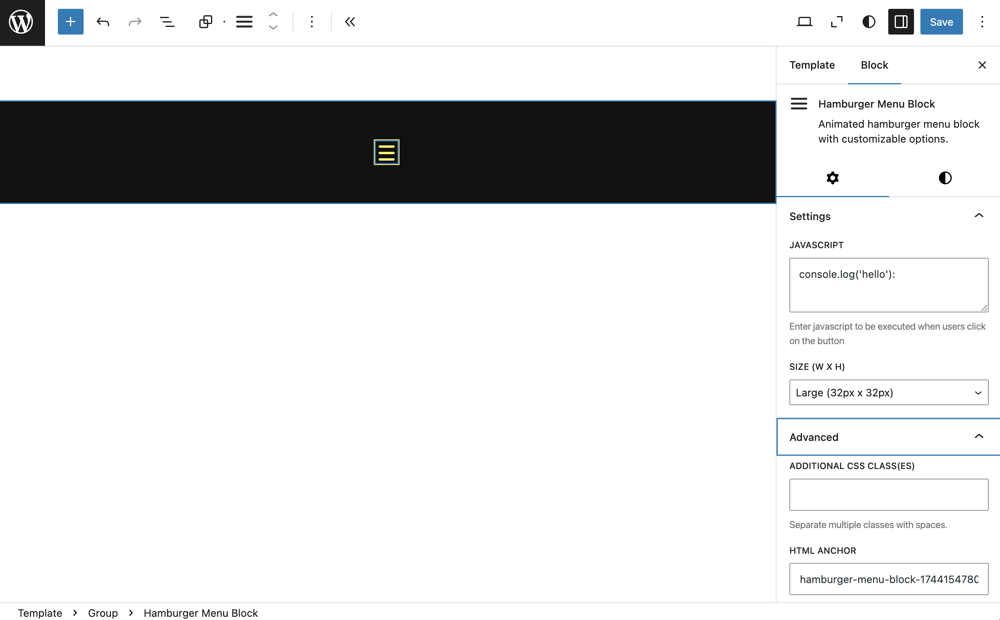

# 🍔 Hamburger Menu Block

A custom Gutenberg block that adds an animated hamburger menu icon with optional JavaScript execution on click.

*The hamburger menu block in action*

## 📝 Description

**Hamburger Menu Block** lets you easily insert a stylish, animated hamburger menu icon into any post or page using the block editor.

When clicked, the icon triggers an animation and allows you to run your own JavaScript code — useful for toggling mobile menus, sidebars, or custom actions.

### ✨ Features

- Clean animated hamburger icon (with CSS animation)
- Toggleable state (open/close)
- Option to add your own JavaScript to run on click
- Fully customizable using block settings panel
- Works well in headers, sidebars, and responsive designs

---

## 🚀 Installation

1. Upload the plugin folder to the `/wp-content/plugins/` directory.
2. Activate the plugin through the **Plugins** menu in WordPress.
3. Use the block editor to add the **"Hamburger Menu Block"** block to your post or page.

---

## 🛠️ Usage

1. Open the block editor (Gutenberg).
2. Search for **"Hamburger Menu Block"** in the block inserter.
3. Add the block to your content.
4. Customize the style, animation, and JavaScript behavior from the block settings sidebar.

## 📄 License

This plugin is licensed under the GPLv2 or later. See the [LICENSE](./LICENSE) file for details.
